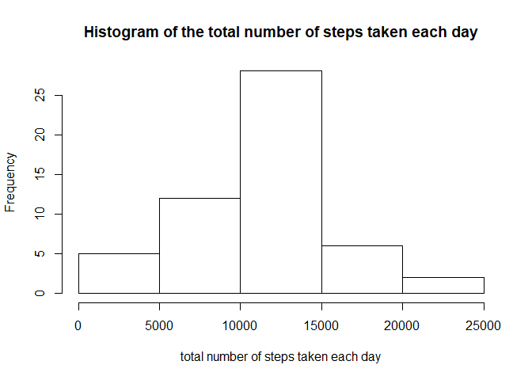
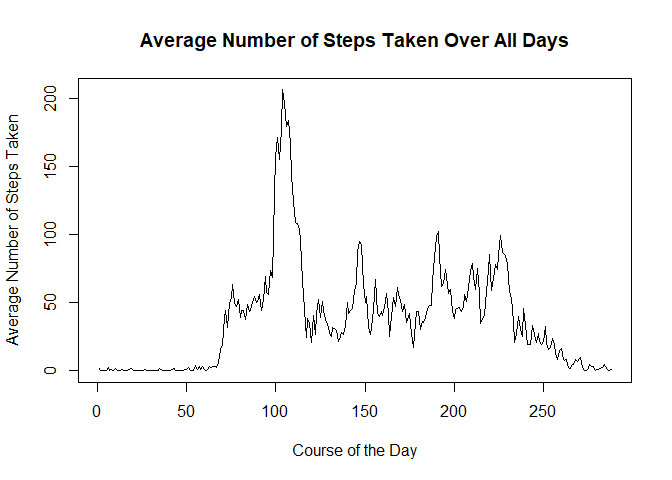
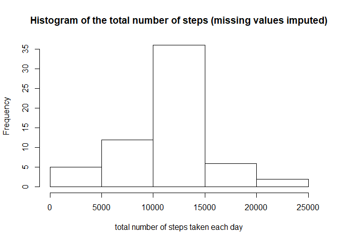
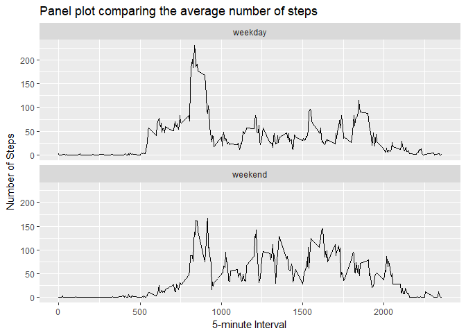

# Reproducible Research: Course Project 1

Loading the R packages used in this analysis:


```r
library(dplyr)
```

```
## 
## Attaching package: 'dplyr'
```

```
## The following objects are masked from 'package:stats':
## 
##     filter, lag
```

```
## The following objects are masked from 'package:base':
## 
##     intersect, setdiff, setequal, union
```

```r
library(ggplot2)
library(knitr)
```


Setting the path to the data:


```r
setwd("C:/Users/Patrick/Documents/Coursera/DataScience/Assignments/Course5/CourseProject1")
```

## Loading and preprocessing the data:

Loading the data:


```r
activity <- read.csv("activity.csv")  # read csv file 
```

Preparing the data for the histogram of the total number of steps taken each day:


```r
total_steps_per_day <- activity %>%
                        filter(!is.na(steps)) %>%
                        group_by(date) %>%
                        summarize(steps_per_day = sum(steps, na.rm=TRUE))
```

Preparing the data to show the average daily activity pattern:


```r
average_steps_per_interval <- activity %>%
                                filter(!is.na(steps)) %>%
                                group_by(interval) %>%
                                summarize(avg_steps = mean(steps, na.rm=TRUE))
```


## What is mean total number of steps taken per day?

Plotting the histogram of the total number of steps taken each day:


```r
hist(total_steps_per_day$steps_per_day, main = "Histogram of the total number of steps taken each day",
     xlab = "total number of steps taken each day")
```

<!-- -->


Calculating the mean and median number of steps taken each day:


```r
mean(total_steps_per_day$steps_per_day)
```

```
## [1] 10766.19
```

```r
median(total_steps_per_day$steps_per_day)
```

```
## [1] 10765
```


## What is the average daily activity pattern?

Plotting the time series of the average number of steps taken (per interval, over all days):


```r
plot(average_steps_per_interval$avg_steps, type="l", main = "Average Number of Steps Taken Over All Days", xlab = "Course of the Day",
     ylab = "Average Number of Steps Taken" )
```

<!-- -->

Which 5-minute interval, on average across all the days in the dataset, contains the maximum number of steps?


```r
average_steps_per_interval[which.max(average_steps_per_interval$avg_steps),]
```

```
## # A tibble: 1 x 2
##   interval avg_steps
##      <int>     <dbl>
## 1      835       206
```

The interval "835"" contains the maximum number of steps (which is 206).

## Imputing missing values

Calculating and reporting the total number of missing values in the dataset (i.e. the total number of rows with NAs):


```r
sum(is.na(activity$steps))
```

```
## [1] 2304
```

Computing the 5-minute interval that, on average, contains the maximum number of steps:


```r
average_steps_per_interval[which.max(average_steps_per_interval$avg_steps),]
```

```
## # A tibble: 1 x 2
##   interval avg_steps
##      <int>     <dbl>
## 1      835       206
```

Imputing missing data by left-joining the number of average steps for each interval and replacing NAs:


```r
activity_adj <- merge(activity,average_steps_per_interval) # left join: add column containing the number of average steps to each interval
activity_adj$steps[is.na(activity_adj$steps)] <- activity_adj$avg_steps[is.na(activity_adj$steps)]
```

Calculating the total number of steps taken each day after missing values are imputed:


```r
total_steps_per_day_adj <- activity_adj %>%
                            select(steps, date, interval) %>%
                            group_by(date) %>%
                            summarize(steps_per_day = sum(steps, na.rm=TRUE))
```

Plotting the histogram of the total number of steps taken each day after missing values are imputed:


```r
hist(total_steps_per_day_adj$steps_per_day, main = "Histogram of the total number of steps (missing values imputed)",
     xlab = "total number of steps taken each day")
```

<!-- -->

Calculation of the mean and median of the total number of steps taken each day after missing values are imputed:


```r
mean(total_steps_per_day_adj$steps_per_day)
```

```
## [1] 10766.19
```

```r
median(total_steps_per_day_adj$steps_per_day)
```

```
## [1] 10766.19
```

The mean of the total daily number of steps did not change as we imputed mean values (for entirely missing days). However, the median slightly changed, now being equal to the mean.


## Are there differences in activity patterns between weekdays and weekends?


Creating a new factor variable called "daytype" in the dataset with two levels - "weekday" and "weekend" indicating whether a given date is a weekday or weekend day:


```r
activity_adj$daytype <- factor(ifelse(weekdays(as.Date(activity_adj$date)) %in% (c("Saturday","Sunday")),"weekend","weekday"))
```

Calculating the average number of steps taken per interval and daytype:


```r
avg_steps_per_interval_adj <- activity_adj %>%
                            select(steps, interval, daytype) %>%
                            group_by(interval, daytype) %>%
                            summarize(avg_steps_per_day = mean(steps))
```

Creating a panel plot comparing the average number of steps taken per 5-minute interval across weekdays and weekends:


```r
p <- qplot(x = interval, y = avg_steps_per_day, data = avg_steps_per_interval_adj, geom = "line")
p + ggtitle("Panel plot comparing the average number of steps") +
    xlab("5-minute Interval") + 
    ylab("Number of Steps") +
    facet_wrap(~daytype, ncol=1)
```

<!-- -->

